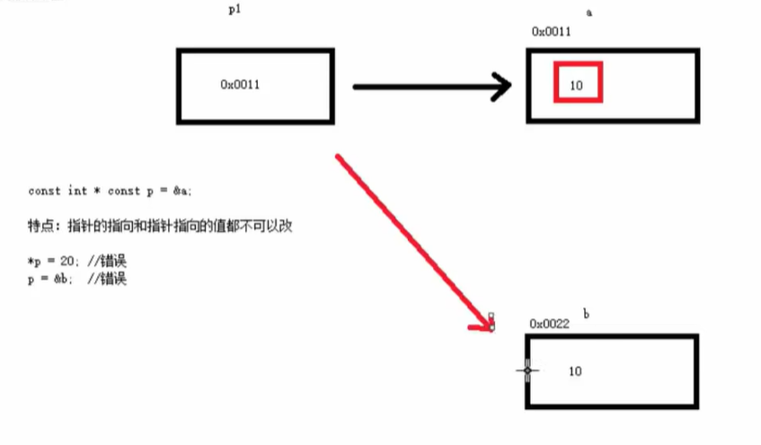

# 10.指针

## 作用

可以通过指针间接访问内存


内存编号从0开始记，一般用十六进制表示

可以利用指针变量保存地址


## 用法

定义指针 int \* p;

建立关系 p = \&a；

解引用（\*p代表指针地址所存数据） \*p = 1000

## 指针所占空间

32位下占4个字节

64位下占8个字节

## 空指针&野指针

### 空指针

指针变量指向内存中编号为0的空间

#### 用途

用于初始化指针变量


空指针指向的内存不可访问


### 野指针

指针变量指向非法内存空间


应尽量避免野指针


## const修饰指针

### const修饰指针

const int \* p = \&a

指针的指向可以修改，但是<mark style="color:red;">指针指向的值不能修改</mark>

.png>)

红框内的值被限定了，不可以修改。但是可以将p从指向a改为指向b。

### const修饰常量

int \* const p = \&a

<mark style="color:red;">指针的指向不可以改</mark>，指针指向的值可以改

.png>)

红线的操作不能执行，但是可以修改黑框内的值。


const + 变量

const int \* p = \&a 指向**整形常量**的指针  <mark style="color:red;">整形常量不能改变</mark>

int \* const p = \&a 指向整形的**常量指针**  <mark style="color:red;">指针地址不能改变</mark>

<mark style="color:red;">const修饰哪个，哪个就不能改变</mark>


### const既修饰指针，又修饰常量

const int \* const p = \&a;

<mark style="color:red;">指针的指向和指针的值都不能改</mark>

<mark style="color:red;"></mark><mark style="color:red;"></mark>

红框和红线内操作都不能执行。

## 指针和数组

```cpp
// Some code
#include<iostream>
using namespace std;

int main() {

	//利用指针遍历数组
	int arr[] = { 1,2,3,4,5,6,7,8,9 };
	int* p = arr;

	//cout << "利用指针输出数组：" << *p << endl;

	for (int i = 0; i < 10; i++) {
		cout << "利用指针遍历数组：" << *p << endl;
		//指针加1，地址加4
		p++;
	}

	system("pause");
	return 0;
}
```

## 指针和函数

```cpp
// Some code
#include<iostream>
using namespace std;

//函数的值传递，形参变化不影响实参
void swap1(int a, int b) {
	int temp;
	temp = a;
	a = b;
	b = temp;
}

//地址传递，
void swap2(int* a, int* b) {
	int temp;
	temp = *a;
	*a = *b;
	*b = temp;
}

int main() {

	int a = 10;
	int b = 20;

	swap1(a,b);

	cout << "swap1之后的a：" << a << endl;
	cout << "swap1之后的b：" << b << endl;

	swap2(&a, &b);
	cout << "swap2之后的a：" << a << endl;
	cout << "swap2之后的b：" << b << endl;


	system("pause");
	return 0;
}
```


值传递<mark style="color:red;">**不会**</mark>改变实参

地址传递<mark style="color:red;">**会**</mark>改变实参

